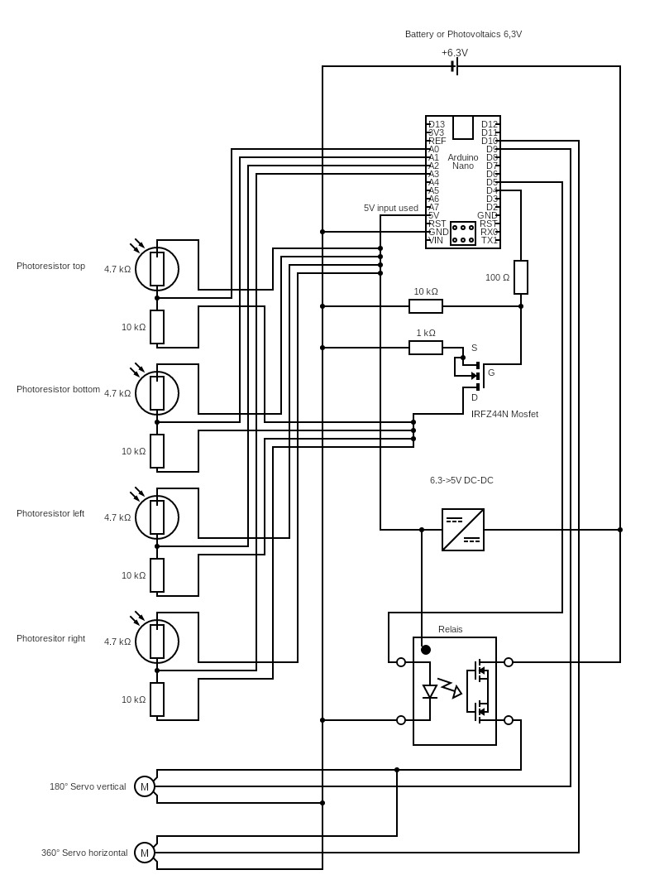
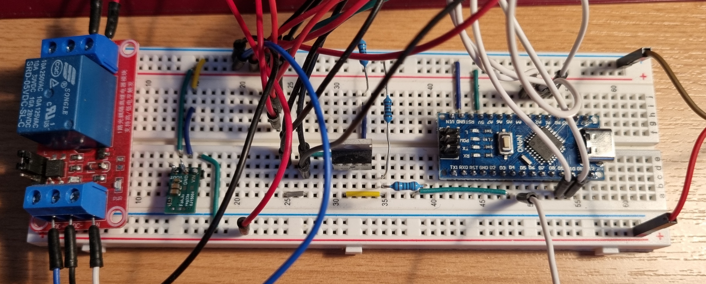
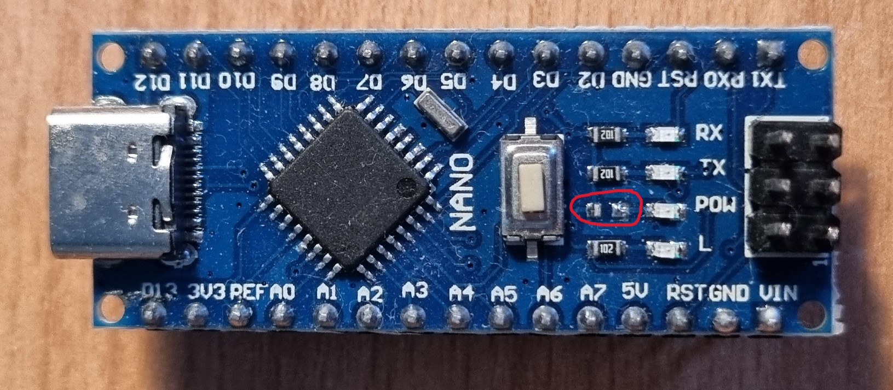
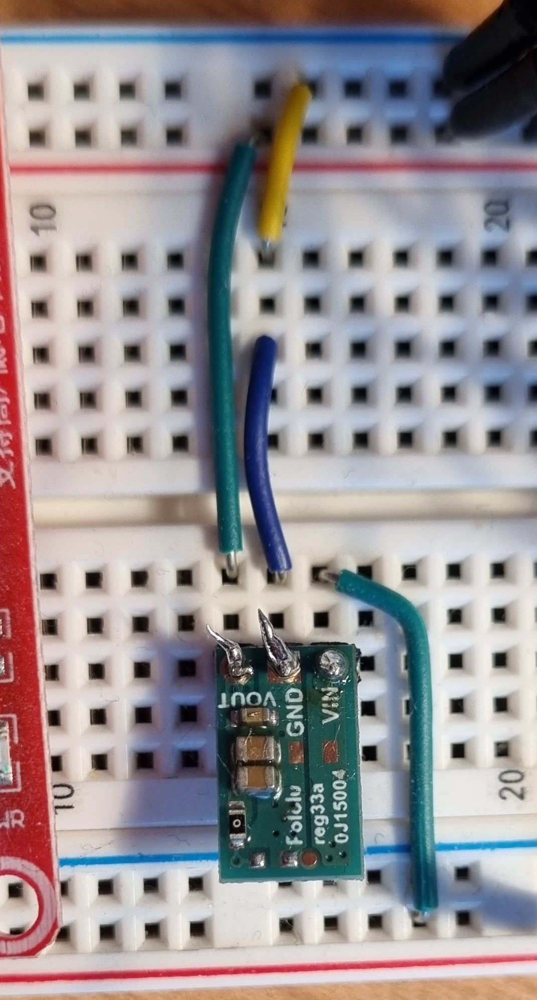

# Extreme Power Saving Solar Flower
Arduino code for a solar tracker

## Motivation
This project was born from a desire to create an efficient solar tracker, often referred to as a "solar flower," capable of continuously orienting a solar panel towards the strongest light source. The primary goal is to maximize energy harvesting for battery charging, even with a small solar panel. A critical aspect of this design is minimizing standby energy consumption to ensure the system's long-term autonomy and efficiency, preventing the tracker itself from consuming a significant portion of the energy it collects. This pursuit of "extreme power saving" is central to the project's design philosophy.

## Hardware Setup
From Amazon, I bought (KEYESTUDIO DIY Solar Tracking Electronic Kit for Arduino UNO IDE, Temperature and Humidity Sensor,BH1750 Light Sensor etc.Edu Programming Program for Adults)[https://www.amazon.de/dp/B0B1NWBTS4?ref=ppx_yo2ov_dt_b_fed_asin_title&th=1]
with an Arduino Uno and all necessary components. However, I wanted to improve the accuracy and duration of the system. 

To improve the accuracy, I put the photo sensors on the back side of the photovoltaic cell, to get the sensors to move with the photovoltaic cell. The principle behind it, is that 
the whole system shall move in the direction of the light. If the left photo sensor gets more light that the right sensor, then move to the left.

The circuit plan is presented in .

A photo of the setup: 

### Arduino

To minimize power consumption, the power LED resistor was removed. This modification prevents the LED from drawing constant current, significantly reducing the overall power footprint of the Arduino Nano, which is crucial for a battery-operated solar tracker.

Additionally, the on-board DC-DC converter was removed. This modification means that the VIN pin can no longer be used with higher voltages without risking damage to the board. Consequently, the only safe power input is directly via the 5V pin, requiring a precisely regulated 5V supply. This further streamlines power usage by bypassing the inefficiencies of the on-board converter.

### Mosfet IRFZ44N

In standby mode the sensors shall not consume any energy. Therefore, the ground part of the circuit 
is turned off with a signal 0 on D4. In case of signal 1, the mosfet lets the current pass to ground. 
Resistors are crucial with MOSFETs due to the MOSFET's gate capacitance. When switching a MOSFET, this capacitance needs to be charged or discharged. Without a gate resistor, a large current can flow, potentially damaging the driving circuit (e.g., a microcontroller). The resistor limits this current, protecting the driver and controlling the MOSFET's switching speed. This controlled switching is vital for managing electromagnetic interference (EMI) and preventing unwanted oscillations or "ringing" in the circuit.

### DC-DC Converter

The input voltage from the solar converter is around 6.3V. For the arduino and the photo resistors, it shall be
5V. Therefore, I use a dc-dc converter from 6.3V to 5V for up to 100mA load with a very low extra power consumption. 

### Relay

Relays are used to control higher power loads with a low-power signal from the Arduino. In this setup, a relay is essential because servo motors, especially when multiple are used or under load, can draw significant current that an Arduino's digital pins cannot directly supply. The relay acts as an electrically operated switch, isolating the Arduino's delicate control circuitry from the higher current demands of the servos, ensuring stable operation and protecting the microcontroller. According to IoTspace.dev [Arduino Relais ansteuern – Schaltplan und Sketch], relays are crucial for such applications due to the limited current and voltage capabilities of microcontrollers.

### Servos

*(Placeholder image for servos)*

The solar flower utilizes two servo motors for precise positioning. A 360° servo is employed for horizontal tracking, allowing continuous rotation to follow the sun's azimuth. For vertical adjustment (altitude), a 180° servo provides the necessary range of motion. These servos receive control signals from the Arduino, but their power supply is managed through the relay to handle their current demands safely and efficiently.

## Software
The core logic for the solar tracker is contained within `solarflower.ino`. This Arduino sketch is responsible for:
*   **Light Sensing:** Reading input from four photoresistors (LDRs) strategically placed to detect light intensity from different directions (Up, Down, Left, Right).
*   **Directional Control:** Calculating the optimal direction for the solar panel by comparing light intensities and controlling two servo motors—one for horizontal (azimuth) and one for vertical (altitude) movement.
*   **Power Management:** Implementing advanced power-saving techniques, including deep sleep modes using the `LowPower` library, to significantly reduce energy consumption when the system is idle or during low light conditions. This includes deactivating power to sensors and servos when not in active use.
*   **Calibration & Error Handling:** Incorporating calibration for photoresistor readings and checking for potential error states, such as disconnected sensors, to ensure reliable operation.
*   **Serial Communication:** Providing serial output for debugging and monitoring sensor values and servo positions.

## Measurements
While moving, the consumption is 80-180mA with 6.3V, i.e. 0.5-1.2W.
If active and not moving, the consumption is 78mA, i.e. 0.5W
Standby power consumption: 0.06mA, i.e. 0.4mW
This measurement of 0.3W for standby power consumption is a critical achievement for this project, especially considering its goal of extreme power saving for a small solar panel application. 

For context, a typical Arduino Nano can consume around 25 mA (approximately 0.125W at 5V) in 
normal operation and about 7.5 mA (0.0375W at 5V) in standby mode without specific power-saving 
optimizations [Arduino Nano: Alle Infos zum Stromverbrauch – CHIP]. While 0.3W might seem higher 
than the absolute minimum achievable with aggressive deep sleep (which can reach microamps), 
it represents the power draw of the entire system, including sensors and peripheral components 
in their low-power states, but not fully disconnected. This figure demonstrates the 
effectiveness of the implemented hardware and software optimizations 
(like MOSFET-controlled sensor power and Arduino sleep modes) in significantly reducing the 
overall energy footprint when the system is not actively tracking. Further optimizations could 
target reducing this to even lower levels, potentially reaching microampere ranges as 
demonstrated in deep sleep tutorials (e.g., Low Power Arduino! Deep Sleep Tutorial).

## Outlook
Future improvements could focus on further refining power consumption, integrating advanced tracking algorithms for cloudy conditions, or exploring alternative energy storage solutions.

## Related Work

### Power Consumption & Sleep Modes
-   **Title:** Low Power Arduino! Deep Sleep Tutorial
    -   **Author:** Unknown
    -   **Link:** https://youtube.com/watch?v=urLSDi7SD8M
    -   **Accessed on:** February 14, 2026
    -   **Content:** This video demonstrates how to achieve deep sleep on an Arduino (ATMEGA328P-PU) to reduce power consumption to approximately 0.287uA. It covers waking the Arduino using a digital input (push button) and an internal watchdog timer, without external libraries.

-   **Title:** Low Power Arduino - Sleeping at 0.3mA perfect for batteries (Arduino Nan...)
    -   **Author:** Unknown
    -   **Link:** https://youtube.com/watch?v=usKaGRzwIMI
    -   **Accessed on:** February 14, 2026
    -   **Content:** (Content unavailable, but the title suggests it's about achieving low power consumption for battery-operated Arduino Nano projects, aiming for around 0.3mA in sleep mode.)

-   **Title:** Arduino Nano: Alle Infos zum Stromverbrauch – CHIP
    -   **Author:** Unknown (CHIP)
    -   **Link:** https://praxistipps.chip.de/arduino-nano-alle-infos-zum-stromverbrauch_101217
    -   **Accessed on:** February 14, 2026
    -   **Content:** This article details the Arduino Nano's power consumption, noting approximately 25 mA in normal operation and 7.5 mA in standby. It highlights that additional components increase power usage and suggests using a multimeter for precise measurements and a Low Power Library for further reduction during idle times.

### MOSFET Usage
-   **Title:** How to use Mosfet
    -   **Author:** Ingenieursmentalität
    -   **Link:** https://www.youtube.com/watch?v=GDZC3B4w-Bg
    -   **Accessed on:** February 14, 2026
    -   **Content:** (Summarized previously in the Mosfet IRFZ44N section, focusing on gate capacitance and resistor necessity for driver protection and controlled switching speed.)

-   **Title:** Here is why MOSFET drivers are sometimes essential! || MOSFET Driver Par...
    -   **Author:** Unknown
    -   **Link:** https://youtube.com/watch?v=8swJ_Bnsgl4
    -   **Accessed on:** February 14, 2026
    -   **Content:** (Summarized previously in the Mosfet IRFZ44N section, emphasizing the role of gate capacitance and resistors in preventing damage to driving circuits and controlling switching.)

### Relay Control
-   **Title:** Arduino Relais ansteuern – Schaltplan und Sketch
    -   **Author:** IoTspace.dev
    -   **Link:** https://iotspace.dev/arduino-relais-ansteuern-schaltplan-und-sketch/
    -   **Accessed on:** February 14, 2026
    -   **Content:** This article explains controlling relays with Arduino, essential for home automation due to microcontrollers' limited current/voltage. It covers relay types (1, 2, 4-channel), selection criteria (voltage, current, triggers), and provides wiring/sketch examples for a 2-channel module.

