# Extreme Power Saving Solar Flower
Arduino code for a solar tracker

## Motivation
This project was born from a desire to create an efficient solar tracker, often referred to as a "solar flower," capable of continuously orienting a solar panel towards the strongest light source. The primary goal is to maximize energy harvesting for battery charging, even with a small solar panel. A critical aspect of this design is minimizing standby energy consumption to ensure the system's long-term autonomy and efficiency, preventing the tracker itself from consuming a significant portion of the energy it collects. This pursuit of "extreme power saving" is central to the project's design philosophy.


## Hardware Setup
From Amazon, I bought [KEYESTUDIO DIY Solar Tracking Electronic Kit for Arduino UNO IDE, Temperature and Humidity Sensor, BH1750 Light Sensor etc. Edu Programming Program for Adults](https://www.amazon.de/dp/B0B1NWBTS4?ref=ppx_yo2ov_dt_b_fed_asin_title&th=1)
with an Arduino Uno and all necessary components. However, I wanted to improve the accuracy and duration of the system.

To improve the accuracy, I put the photo sensors on the back side of the photovoltaic cell, so the sensors move with the photovoltaic cell. The principle is that the whole system moves in the direction of the light. If the left photo sensor gets more light than the right sensor, then the system moves to the left.

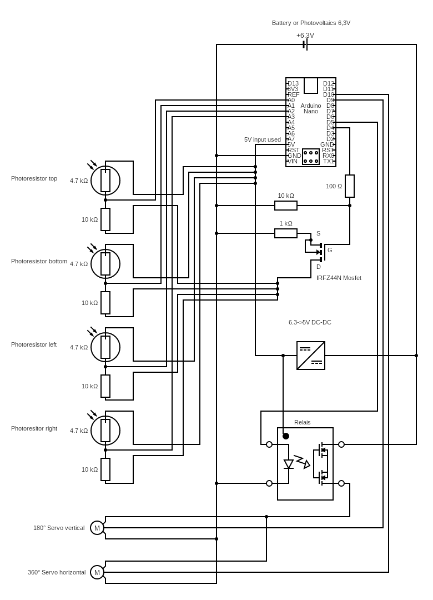

The circuit plan shows the power switching, the four photoresistors, the servo control lines, and the regulated 5V supply.

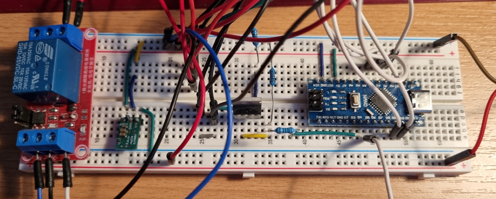

This photo shows the first breadboard wiring of the circuit.

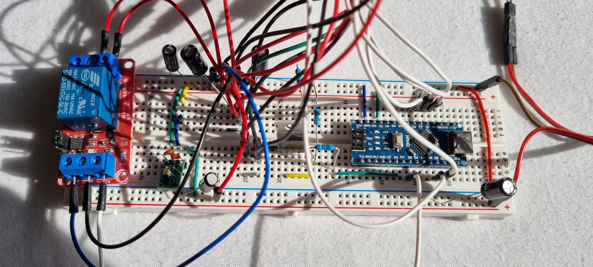

The final breadboard adds capacitors (condensators) near the motor power lines. They were added after the motors sometimes made strange, uncontrolled movements. The reason is that servos create short current peaks when they start, stop, or hold position under load. Those current peaks can pull the supply voltage down for a very short time and inject electrical noise into the circuit. The capacitors act as local energy buffers: they provide current during these short peaks and smooth voltage drops before they disturb the Arduino, the sensors, or the servo signal.

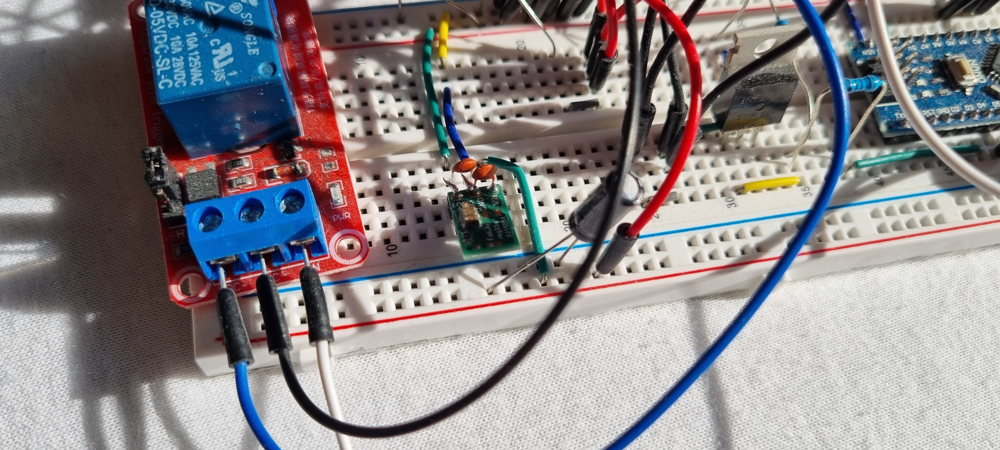

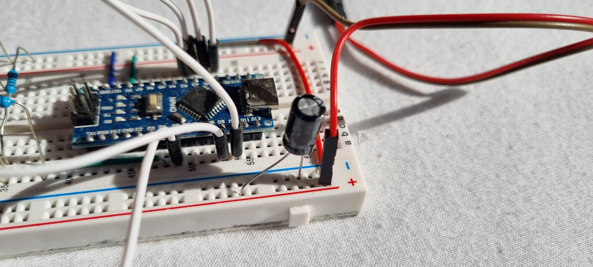

The capacitor placement is intentionally close to the breadboard power rails and motor supply wiring, because long wires and breadboard contacts add resistance and inductance. Local buffering is most effective when it is physically close to the load that causes the disturbance.

### Sensor Calibration

The four photoresistors must be calibrated as pairs before they are mounted in the tracker. The important requirement is that the Top-Bottom pair and the Left-Right pair show the same measurement curves. If the paired sensors are not calibrated together, one side will always behave differently from the other side and the tracker can turn away from the optimal direction.

This is especially important across different light intensities. Two uncalibrated sensors may show the same value in low light, but differ significantly at higher light intensities. I tried to compensate for bad calibration in software, but this is a very hard task and did not work well enough.

The calibration method is:

1. Measure all photoresistors under constant low light intensity.
2. Measure all photoresistors under constant high light intensity.
3. Compare the values and select sensor pairs that match at both light levels. These matching pairs can then be used for the Top-Bottom and Left-Right sensor positions.

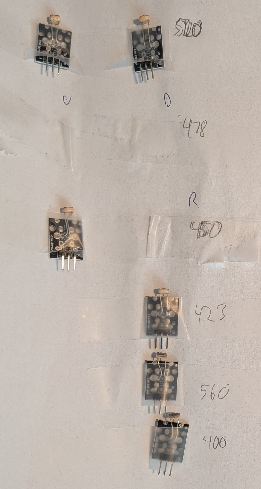

The image shows the measured photoresistor values at low and high light intensity, making it easier to identify matching sensor pairs for the Top-Bottom and Left-Right positions.

### Solar Flower Assembly

I bought the KEYESTUDIO DIY Solar Tracking Electronic Kit from Amazon and modified the assembly.

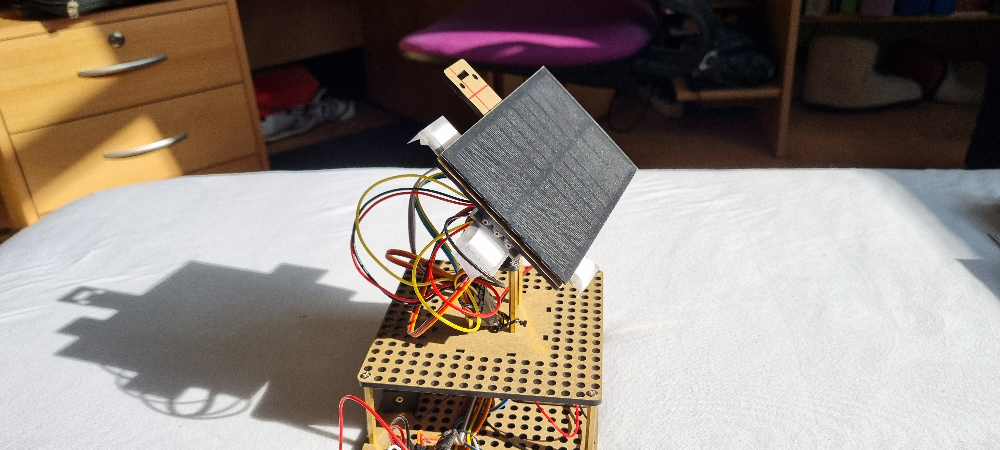

The front view shows the photovoltaic cell and the flower structure that is moved by the two servos.

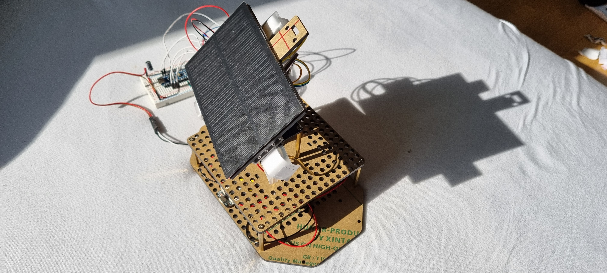

This view shows the final front assembly with the sensor and panel arrangement.

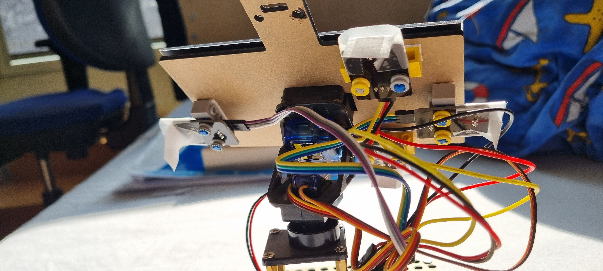

The rear view shows the electronics and wiring attached behind the moving panel.

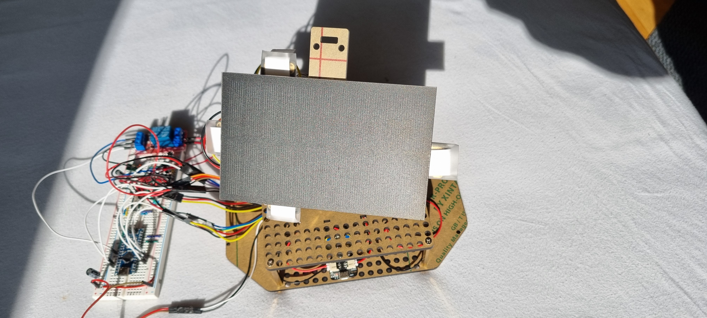

The top view shows the geometry of the panel, light sensors, and mechanical movement axes.

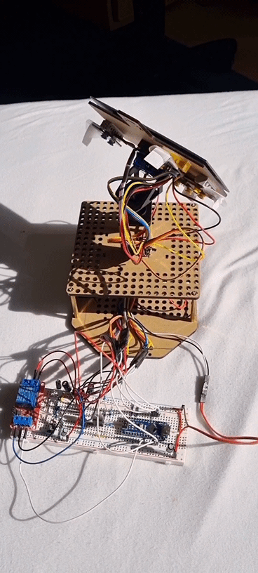

The tracker moves in small steps toward the stronger light source instead of running continuously. This keeps the control simple and reduces unnecessary motor activity.

### Arduino
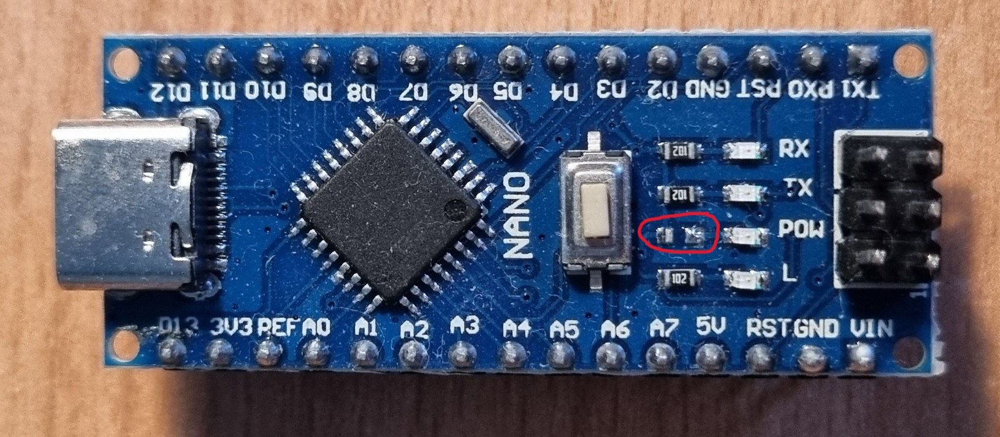
To minimize power consumption, the power LED resistor was removed. This modification prevents the LED from drawing constant current, significantly reducing the overall power footprint of the Arduino Nano, which is crucial for a battery-operated solar tracker.

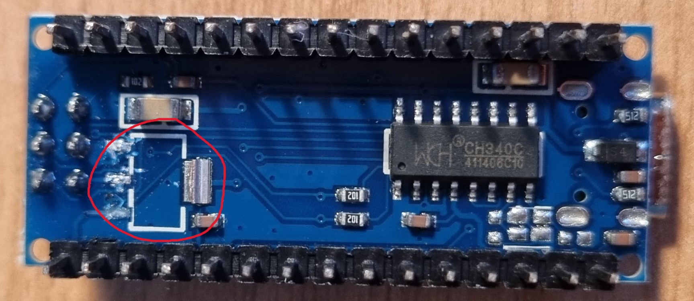
Additionally, the on-board DC-DC converter was removed. This modification means that the VIN pin can no longer be used with higher voltages without risking damage to the board. Consequently, the only safe power input is directly via the 5V pin, requiring a precisely regulated 5V supply. This further streamlines power usage by bypassing the inefficiencies of the on-board converter.

### Troubleshooting
If the serial connection is unstable or uploads do not work reliably, lower the baud rate. A working setting for this setup is:
ATmega328P Old bootloader with baud rate 57600

### Mosfet IRFZ44N
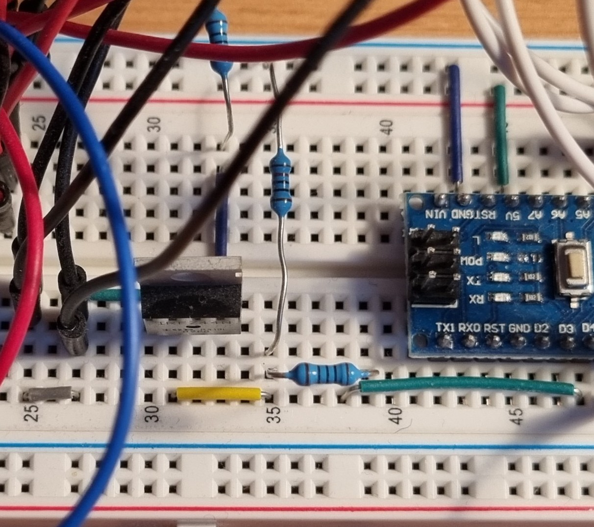

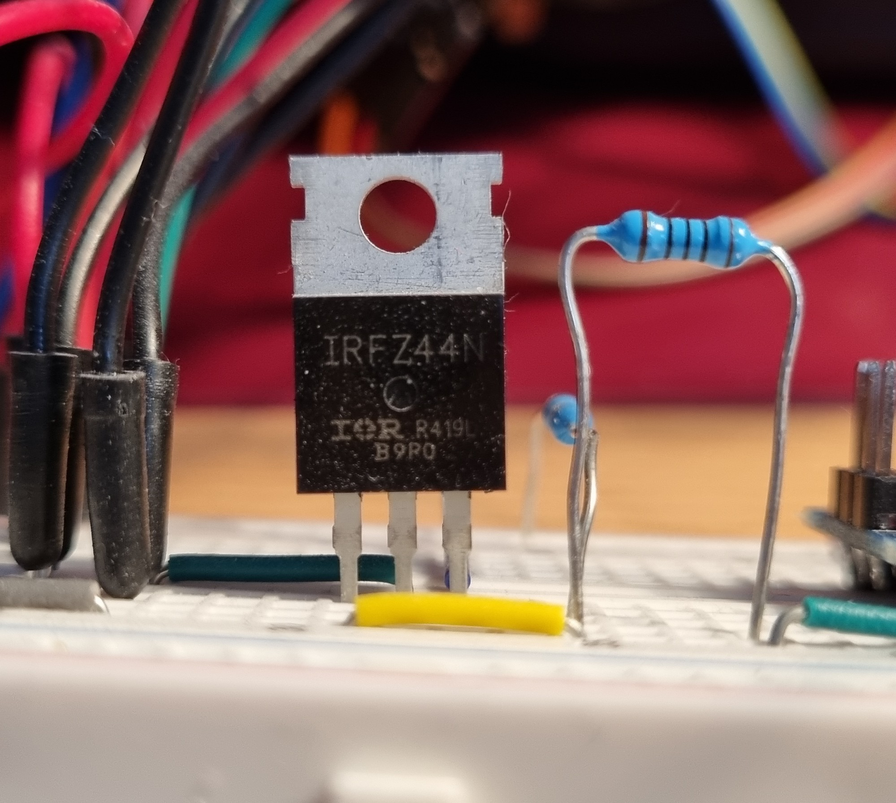

In standby mode the sensors shall not consume any energy. Therefore, the ground part of the circuit 
is turned off with a signal 0 on D4. In case of signal 1, the mosfet lets the current pass to ground. 
Resistors are crucial with MOSFETs due to the MOSFET's gate capacitance. When switching a MOSFET, this capacitance needs to be charged or discharged. Without a gate resistor, a large current can flow, potentially damaging the driving circuit (e.g., a microcontroller). The resistor limits this current, protecting the driver and controlling the MOSFET's switching speed. This controlled switching is vital for managing electromagnetic interference (EMI) and preventing unwanted oscillations or "ringing" in the circuit.

### DC-DC Converter
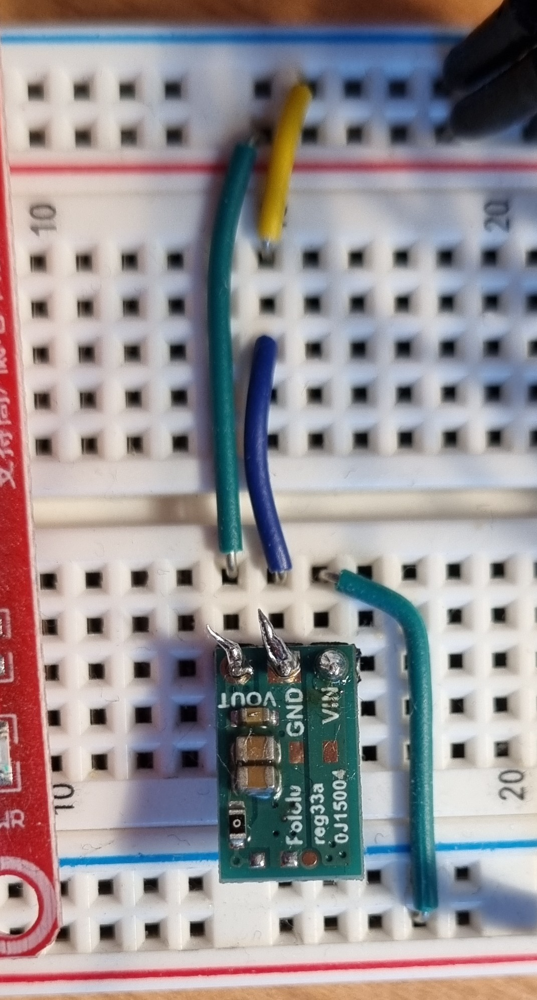

The input voltage from the solar converter is around 6.3V. For the arduino and the photo resistors, it shall be
5V. Therefore, I use a dc-dc converter from 6.3V to 5V for up to 100mA load with a very low extra power consumption. 

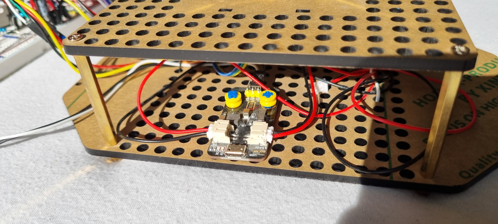

The solar converter charges the battery from the photovoltaic cell and provides the input voltage for the tracker electronics.

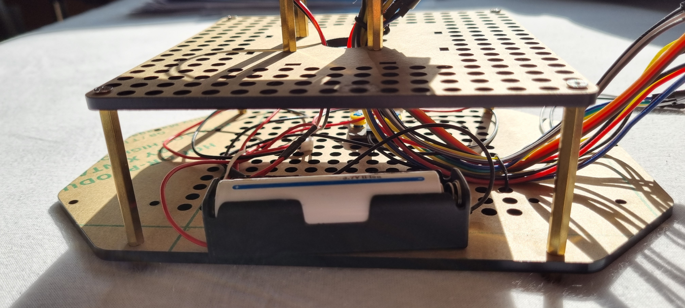

The battery is the energy buffer for the system. The software avoids movement when the measured internal voltage is too low, because servo movements need short current peaks and should not be attempted when the battery is nearly empty.

### Relay
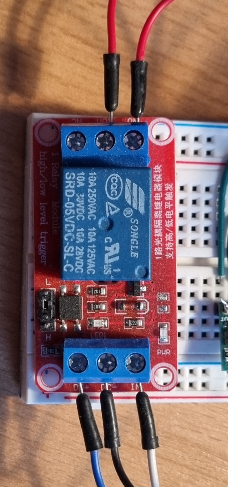

Relays are used to control higher power loads with a low-power signal from the Arduino. In this setup, a relay is essential because servo motors, especially when multiple are used or under load, can draw significant current that an Arduino's digital pins cannot directly supply. The relay acts as an electrically operated switch, isolating the Arduino's delicate control circuitry from the higher current demands of the servos, ensuring stable operation and protecting the microcontroller. According to IoTspace.dev [Arduino Relais ansteuern – Schaltplan und Sketch], relays are crucial for such applications due to the limited current and voltage capabilities of microcontrollers.

### Servos

The solar flower utilizes two servo motors for precise positioning. A 360° servo is employed for horizontal tracking, allowing continuous rotation to follow the sun's azimuth. For vertical adjustment (altitude), a 180° servo provides the necessary range of motion. These servos receive control signals from the Arduino, but their power supply is managed through the relay to handle their current demands safely and efficiently.

## Software
The core logic for the solar tracker is contained within `solarflower.ino`. The purpose of the logic is to move only when movement is useful, keep the flower pointed toward the strongest light source, avoid unstable motor behavior, protect the battery, and recover from edge positions without requiring a manual reset.

The sketch is responsible for:
- **Light sensing:** Read four photoresistors: up, down, left, and right.
- **Directional control:** Compare left/right for horizontal movement and up/down for vertical movement.
- **Power management:** Switch sensors and servos off when they are not needed, then use `LowPower.powerDown()` between cycles.
- **Noise reduction:** Take several sensor measurements per cycle and use averages instead of a single reading.
- **Error handling:** Stop normal movement when the voltage is too low or the sensor state is invalid.
- **Recovery:** Slowly return the flower to its initial position after many long sleep cycles at a vertical end stop.
- **Logging:** Print one structured line per loop with sensor values, movement decisions, voltage, and power state.

### Sensor Measurement
Each loop starts by powering the sensors, waiting for the readings to stabilize, and measuring each photoresistor three times with a 100ms interval. The code averages the three readings for each direction and also calculates the variance of the average light level across the three measurements.

The averaging avoids movement caused by short voltage dips or electrical noise. The variance is logged so unstable measurements can be recognized in the serial output.

Example log token:

```text
[SENSORS] U:642 D:616 L:572 R:655 avg:621 var:0.00 Vcc:4829mV
```

### Error Thresholds
The tracker does not react to every small sensor difference. It uses an error threshold so small differences do not cause constant jitter.

- `initError`: small threshold for normal tracking.
- `afterSleepError`: larger threshold directly after sleep.
- `lowLightError`: larger threshold when the average light value is below `minPhotoResistorSolarValue`.

This prevents unnecessary servo movements when the sun moves only slightly, the sensor readings fluctuate, or the light is too weak for useful tracking.

### Horizontal Movement
Horizontal movement is decided first because the left/right position strongly affects whether the vertical sensors are meaningful.

- If `abs(left - right) <= error`, horizontal is `STEADY` and the horizontal servo does not move.
- If `left > right`, the target angle is reduced by `resolution` and the log state is `LEFT`.
- If `right > left`, the target angle is increased by `resolution` and the log state is `RIGHT`.
- If the target angle would go below `servoHorizontalMinAngle`, it is clamped and logged as `LEFT(LIMIT)`.
- If the target angle would go above `servoHorizontalMaxAngle`, it is clamped and logged as `RIGHT(LIMIT)`.
- `moveHorz` is only true when the horizontal servo will actually receive a new angle. A limit state is not movement.

This distinction matters because vertical movement is allowed whenever horizontal is not actually moving, including the cases `STEADY`, `LEFT(LIMIT)`, and `RIGHT(LIMIT)`.

### Vertical Movement Priority
The vertical priority logic exists because the flower can get stuck when it moves vertically too early. At low vertical angles, the panel geometry can make the horizontal sensors misleading. The code therefore gives horizontal movement priority only when horizontal movement is really possible and active.

Vertical movement is allowed when at least one of these cases is true:

- The current vertical angle is at or above `minVerticalPriorityDegree` (`40deg`), so both axes may move.
- The horizontal motor is not moving (`!moveHorz`), including horizontal steady and horizontal limit states.
- The requested vertical direction is downward, because moving down helps recover from the critical low-angle area.

If none of these cases is true, vertical movement is blocked and logged as `WAITING(HORZ)`.

After vertical movement is allowed, the up/down decision is:

- If `abs(down - up) <= error`, vertical is `STEADY`.
- If `up > down`, the target angle is reduced and logged as `UP`.
- If `down > up`, the target angle is increased and logged as `DOWN`.
- If the target angle would exceed the configured vertical limits, it is clamped and logged as `UP(LIMIT)` or `DOWN(LIMIT)`.

The important rule is: any time the horizontal motor does not move, the vertical motor is allowed to move if the up/down sensors request it.

### Applying Movement
After the target angles are calculated, the code powers the servos only if at least one axis must move. Then it writes the new horizontal and/or vertical angle.

- If `moveHorz || moveVert` is true, servo power is activated and the system stays active for `initLoopDelay`.
- If neither axis moves, servo power is deactivated and the system sleeps.

This keeps motor power off during standby and prevents the servos from consuming holding current all the time.

### Sleep Behavior
The software uses two normal sleep durations:

- `shortSleepTime`: used after recent movement or when the system should check again soon.
- `longSleepTime`: used after repeated idle cycles.

`longSleepCount` tracks how often the system has slept. When movement happens, `longSleepCount` is reset to zero. When the system sleeps, the count is increased and included in the log.

### Low Voltage Protection
The Arduino measures its own Vcc. If it drops below `minInternalVoltage`, the system enters an error state and does not move the servos. Instead, it sleeps for `lowPowerSleeptime` so the battery can recover through solar charging.

This protects the battery and avoids brownout-like behavior, where the servos pull the voltage down and cause unstable electronics.

### Slow Reset Recovery
If the flower has slept for many long cycles and the vertical axis is at its minimum or maximum angle, `slowReset` is activated. In slow reset mode, the sensor values are ignored and both servos move step by step back to the configured initial angles:

- Horizontal returns to `servoHorizontalInitAngle`.
- Vertical returns to `servoVerticalInitAngle`.
- The movement uses the same `resolution` step size as normal tracking.
- When both axes reach their initial angles, slow reset ends and normal tracking resumes.

This handles cases where the flower reached an end position during weak light, night, shadows, or misleading sensor readings.

### Log Format
Every loop produces one compact log line. The line contains sensor values, movement decisions, and the final power state.

Example:

```text
[SENSORS] U:642 D:616 L:572 R:655 avg:621 var:0.00 Vcc:4829mV | [GO HOR] 270deg RIGHT(LIMIT) | [GO VER] 38deg UP | [PWR] ACTIVE 100ms
```

In this example, the horizontal axis wanted to move right but was already at the right limit, so the horizontal motor did not move. Because horizontal was not actually moving, vertical movement was allowed.

## Measurements

### Battery Capacity

The battery used in this setup is an 18650-style lithium-ion cell. Its remaining capacity can be roughly estimated by measuring the DC voltage with a multimeter. This is not an exact capacity measurement, because lithium-ion batteries have a relatively flat discharge curve and the measured voltage depends on load, temperature, battery age, and whether the battery has just been charged or discharged. For a practical field check, however, the voltage is still useful.

Set the multimeter to DC voltage and measure directly across the battery terminals. If possible, measure the battery after it has rested for a short time without charging or powering the tracker, because servo load peaks can temporarily pull the voltage down.

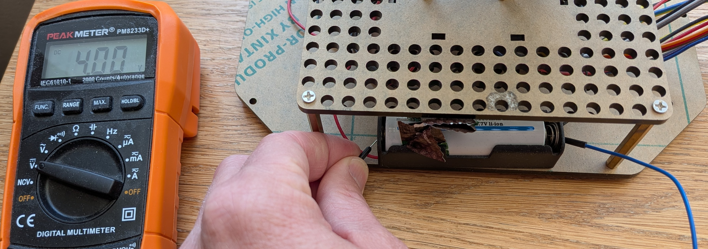

The measurement shows the battery voltage check with a multimeter.

A typical lithium-ion cell has a nominal voltage around 3.6-3.7V and is normally charged up to about 4.2V per cell. In this setup, a fully charged battery measurement is around 4.0V. If the measured voltage drops below around 3.2V, the battery is very discharged for this application. At that point there is not enough stable power to run the servos reliably, because the short servo current peaks can make the voltage sag further.

The software handles this case in [Low Voltage Protection](#low-voltage-protection). The Arduino measures its internal voltage, and if it drops below the configured limit, the system stops moving the servos and sleeps instead. This prevents the tracker from repeatedly starting, pulling the voltage down, stopping, and starting again.

### Minimum Power Consumption

While moving, the consumption is 80-180mA with 6.3V, i.e. 0.5-1.2W.

If active and not moving, the consumption is 78mA, i.e. 0.5W

Standby power consumption: 0.06mA, i.e. 0.4mW.

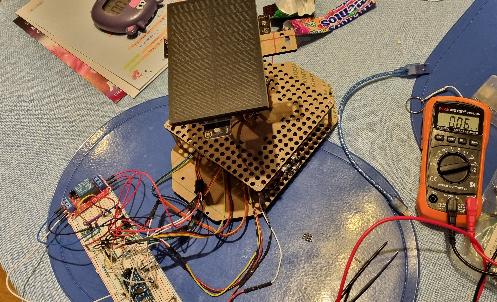

The measurement shows the very low standby current after the Arduino and peripheral power-saving changes. This is the main reason for switching off sensors and servos between tracking cycles instead of leaving the whole circuit powered.

For context, a typical Arduino Nano can consume around 25 mA (approximately 0.125W at 5V) in 
normal operation and about 7.5 mA (0.0375W at 5V) in standby mode without specific power-saving 
optimizations [Arduino Nano: Alle Infos zum Stromverbrauch – CHIP]. While 0.3W might seem higher 
than the absolute minimum achievable with aggressive deep sleep (which can reach microamps), 
it represents the power draw of the entire system, including sensors and peripheral components 
in their low-power states, but not fully disconnected. This figure demonstrates the 
effectiveness of the implemented hardware and software optimizations 
(like MOSFET-controlled sensor power and Arduino sleep modes) in significantly reducing the 
overall energy footprint when the system is not actively tracking. Further optimizations could 
target reducing this to even lower levels, potentially reaching microampere ranges as 
demonstrated in deep sleep tutorials (e.g., Low Power Arduino! Deep Sleep Tutorial).


## Outlook and Improvements
TBD


## Usages

One practical use of the solar flower is charging a phone from a small custom loading box. The box contains two 18650-style lithium-ion batteries that act as an energy buffer between the solar charging circuit and the phone. This makes the setup more stable than connecting the phone directly to the solar panel, because the batteries can store energy while the panel is in sunlight and provide a steadier output when the light changes.

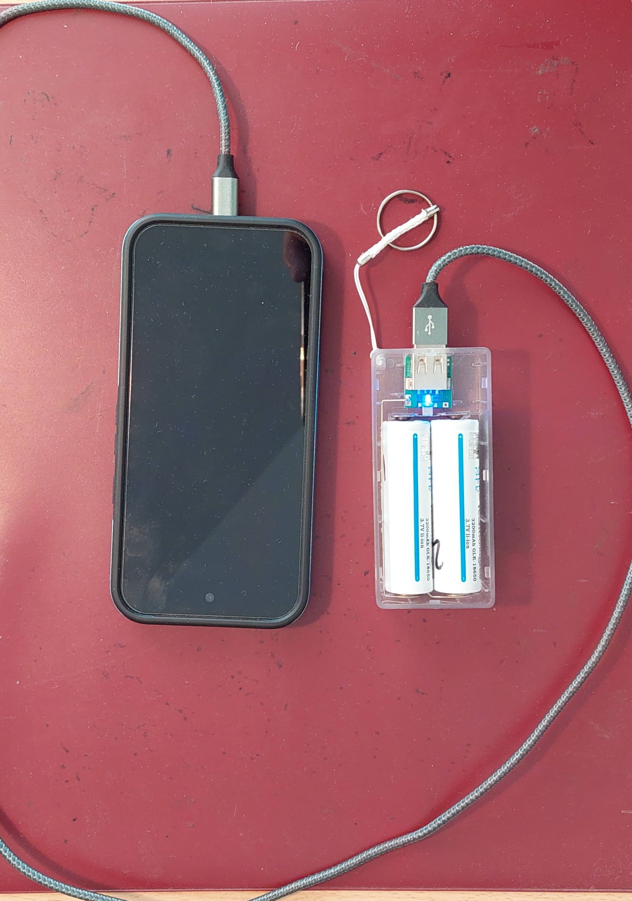


## Related Work

### Power Consumption & Sleep Modes
-   **Title:** Low Power Arduino! Deep Sleep Tutorial
    -   **Author:** Unknown
    -   **Link:** https://youtube.com/watch?v=urLSDi7SD8M
    -   **Accessed on:** February 14, 2026
    -   **Content:** This video demonstrates how to achieve deep sleep on an Arduino (ATMEGA328P-PU) to reduce power consumption to approximately 0.287uA. It covers waking the Arduino using a digital input (push button) and an internal watchdog timer, without external libraries.

-   **Title:** Low Power Arduino - Sleeping at 0.3mA perfect for batteries (Arduino Nan...)
    -   **Author:** Unknown
    -   **Link:** https://youtube.com/watch?v=usKaGRzwIMI
    -   **Accessed on:** February 14, 2026
    -   **Content:** (Content unavailable, but the title suggests it's about achieving low power consumption for battery-operated Arduino Nano projects, aiming for around 0.3mA in sleep mode.)

-   **Title:** Arduino Nano: Alle Infos zum Stromverbrauch – CHIP
    -   **Author:** Unknown (CHIP)
    -   **Link:** https://praxistipps.chip.de/arduino-nano-alle-infos-zum-stromverbrauch_101217
    -   **Accessed on:** February 14, 2026
    -   **Content:** This article details the Arduino Nano's power consumption, noting approximately 25 mA in normal operation and 7.5 mA in standby. It highlights that additional components increase power usage and suggests using a multimeter for precise measurements and a Low Power Library for further reduction during idle times.

### Battery Voltage & State of Charge
-   **Title:** BU-409: Charging Lithium-ion
    -   **Author:** Battery University
    -   **Link:** https://www.batteryuniversity.com/article/bu-409-charging-lithium-ion
    -   **Accessed on:** May 30, 2026
    -   **Content:** This article explains lithium-ion charging behavior, including the common 4.20V per-cell charge voltage and why charging is stopped when the current has dropped sufficiently.

-   **Title:** BU-903: How to Measure State-of-charge
    -   **Author:** Battery University
    -   **Link:** https://batteryuniversity.com/article/bu-903-how-to-measure-state-of-charge
    -   **Accessed on:** May 30, 2026
    -   **Content:** This article explains that voltage-based state-of-charge measurement is simple but imprecise, especially for lithium-based batteries and when the battery has recently been charged or discharged.

-   **Title:** NCR18650GA: Lithium-ion Batteries
    -   **Author:** Panasonic Energy
    -   **Link:** https://energy.panasonic.com/language-masters/en/business/products/lithium-ion/models/NCR18650GA
    -   **Accessed on:** May 30, 2026
    -   **Content:** This product page gives an example 18650 lithium-ion cell with a nominal voltage of 3.60V.

### MOSFET Usage
-   **Title:** How to use Mosfet
    -   **Author:** Ingenieursmentalität
    -   **Link:** https://www.youtube.com/watch?v=GDZC3B4w-Bg
    -   **Accessed on:** February 14, 2026
    -   **Content:** (Summarized previously in the Mosfet IRFZ44N section, focusing on gate capacitance and resistor necessity for driver protection and controlled switching speed.)

-   **Title:** Here is why MOSFET drivers are sometimes essential! || MOSFET Driver Par...
    -   **Author:** Unknown
    -   **Link:** https://youtube.com/watch?v=8swJ_Bnsgl4
    -   **Accessed on:** February 14, 2026
    -   **Content:** (Summarized previously in the Mosfet IRFZ44N section, emphasizing the role of gate capacitance and resistors in preventing damage to driving circuits and controlling switching.)

### Relay Control
-   **Title:** Arduino Relais ansteuern – Schaltplan und Sketch
    -   **Author:** IoTspace.dev
    -   **Link:** https://iotspace.dev/arduino-relais-ansteuern-schaltplan-und-sketch/
    -   **Accessed on:** February 14, 2026
    -   **Content:** This article explains controlling relays with Arduino, essential for home automation due to microcontrollers' limited current/voltage. It covers relay types (1, 2, 4-channel), selection criteria (voltage, current, triggers), and provides wiring/sketch examples for a 2-channel module.
